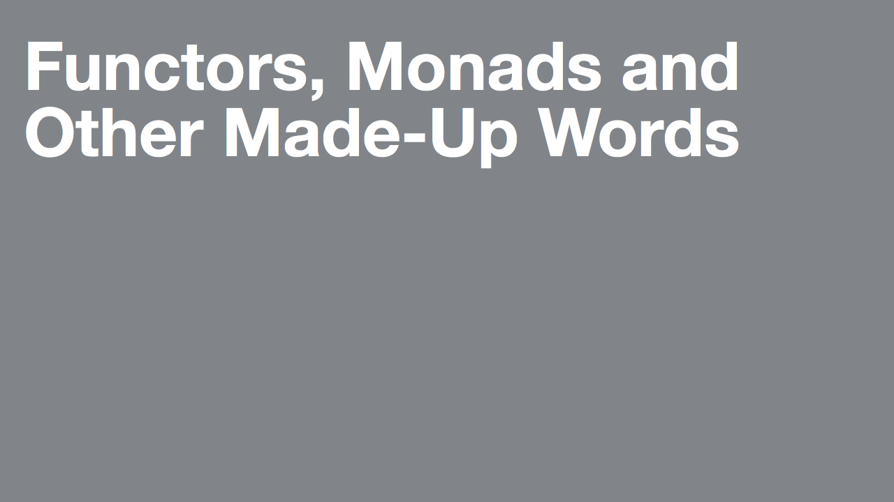

---

I made this talk to force myself to digest some of the things I learned watching Gordon Fontenot's talk, [How I Learned To Stop Worrying And Love The Functor](https://github.com/gfontenot/talks/tree/master/Functors), which really made some concepts click for me and I'd recommend reading it.

The PDF was generated from the Markdown file with [Deckset](http://www.decksetapp.com) using the grey Zurich theme, which was also what I used to present.

The playground was what I used to develop the talk. I found it really powerful to play with code and prose at the same time, and I hope it can be something to aid learning how everything works that you can experiment with.

It was presented to my coworkers at Robots and Pencils in April 2015.
